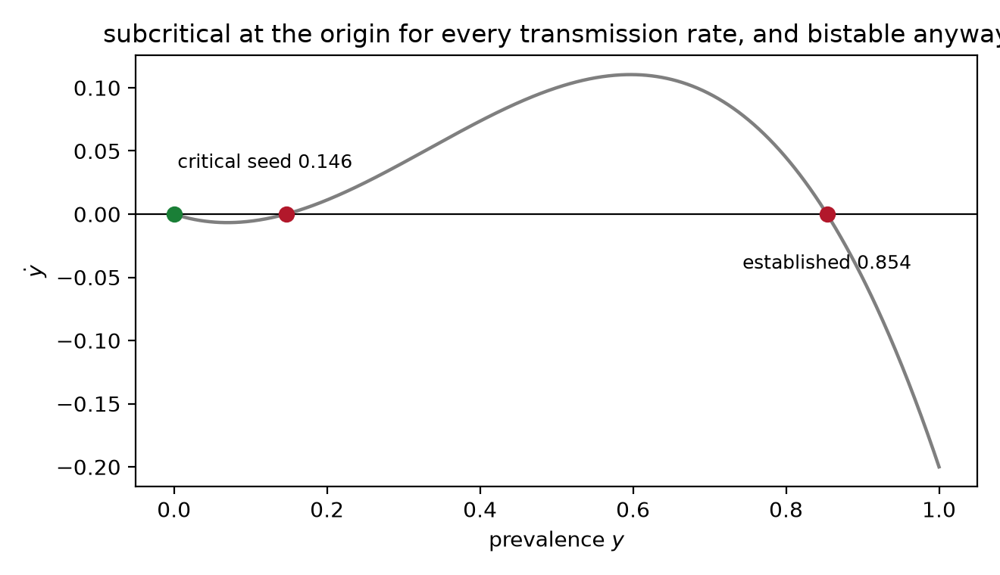

## Abstract

A recurring proposal in political epistemology is that a society should not try to abolish false beliefs but should instead make organised falsehood non-reproducing, holding the reproduction number of a belief formation below one while leaving expression free. Its central safeguard against becoming censorship is that interventions act on processes rather than propositions. This paper shows that the safeguard is empty, and then repairs the proposal by changing what the system is asked to maximise. Model a claim-centred formation as a two-type branching process over active transmitters and organisational units, with lifetime offspring matrix $K$ and formation reproduction number $\mathcal{R}_F = \rho(K)$; in the baseline architecture used throughout, $K = [[1.6, 4.0],[0.1, 0.3]]$ and $\mathcal{R}_F = 1.856918$. The first result is a triviality with a sharp consequence: truth is not an argument of $K$, so any intervention that is a function of the architecture alone induces the same change in $\log \mathcal{R}_F$ for a refuted formation and for a vindicable one that shares that architecture. The simulation reports the discrepancy as exactly zero across four levers and three intensities. Content-neutral process interventions are therefore not approximately blind to truth; they are blind by construction, and discrimination requires either a claim-level classifier, which reintroduces the problem the process framing was introduced to avoid, or an architectural asymmetry between refuted and vindicable formations, which the paper tests and finds running the wrong way: as the refuted formation's organisational channel grows relative to the challenger's, the discrimination index of uniform friction falls from $0.199$ to $0.068$. The repair is a transition every model in this literature omits. A formation has a third fate besides persistence and extinction, namely absorption, in which its claim-set is taken up by the general infrastructure and the formation dissolves because nobody organises to defend what everyone teaches. Absorption is the success mode of true heterodoxy, it is unavailable to a robustly refuted claim, and its rate is a system parameter an institution can raise without knowing which claims are true. Held to equal suppression of the refuted formation, the three process levers that can reach the target cut the vindicable claim's absorption probability from $0.4985$ to between $0.3255$ and $0.360$, while raising absorptive capacity reaches the same suppression and raises absorption to $0.820$. A fourth lever, demonetisation, cannot reach the target at any admissible intensity, because it touches a channel whose two entries hold $0.118760$ and $0.022884$ of the elasticity of $\mathcal{R}_F$ while the transmitter entry holding $0.739597$ is supercritical on its own. Finally, subcriticality does not deliver even what it promises: under reinforcement the linearisation at zero is stable for every transmission rate while an established formation at $0.854$ persists above a critical seed of $0.146$. The construct prices a stipulated mechanism and measures no real movement. What it establishes is that an epistemic system should be judged by how fast a claim can be brought to decision rather than by how effectively organised claims can be suppressed.

## 1. The Safeguard That Does Not Work

The proposal this paper begins from is attractive and increasingly common. Rather than debunking beliefs one at a time, a society should attend to whether organised falsehood can reproduce itself: a belief may be entertained, expressed, and privately held, and the epistemic order is nonetheless healthy so long as no demonstrably false claim can assemble a durable formation with recruiters, organisations, finances, and successors. The proposal borrows a threshold from epidemiology, keeps the reproduction number of the formation below one, and its authors are careful to add a safeguard: interventions should structure processes and incentives rather than prohibit propositions. That is what is supposed to keep the programme on the democratic side of the line. It does not.

The machinery is not new and should not be advertised as such. Epidemiological models of idea diffusion are decades old, and the reproduction number has already been estimated for ideas (Bettencourt, Cintrón-Arias, Kaiser and Castillo-Chávez, 2006); an opinion reproduction number for content cascades on networks was published recently (Brooks and Porter, 2025); Sperber (1985) proposed an epidemiology of representations while warning that representations transform in transmission; and next-generation construction with a multitype offspring matrix is standard technique (Diekmann, Heesterbeek and Roberts, 2010). The programme's genuine contribution lies elsewhere, in the choice of evaluand: whether an organised formation can replace its own transmitters and organisations is a different question from whether individuals hold false beliefs, and it is not the question the intervention literature measures.

This paper is about the safeguard rather than the machinery. Take the formation's reproduction number seriously as an object, write down what an intervention does to it, and the safeguard collapses in one line. The reproduction number is a function of the formation's architecture: how many assenters a transmitter reaches, how many survive to transmit, how long organisations last, how many organisations they found. The truth of the claim-set appears nowhere in that function, because a recruitment rate does not know what it is recruiting for. An intervention that is content-neutral is by definition a map on the architecture alone. Two formations with the same architecture therefore receive the same treatment, whatever their claims. Truth never enters the calculation. The proposal's safeguard guarantees precisely the property that makes the tool useless for its stated purpose.

That result is trivial, and it is the reason to write the paper, because everything interesting is downstream of it. If content-neutral levers cannot discriminate, then either discrimination is abandoned, or a classifier is admitted at the claim level with all the false-positive machinery the process framing was introduced to avoid, or someone shows that refuted and vindicable formations differ architecturally in a way that uniform pressure exploits. Section 4 tests the third option and finds it running backwards. Section 5 proposes a fourth path, which is to stop trying to discriminate with suppression at all.

## 2. The Formation and Its Reproduction Number

A proposition does not recruit anyone, collect money, or found a channel. Persons and organisations do those things, and what persists across a generation of participants is a package: a core claim-set, its permitted variants, characteristic narratives, differentiated roles, practices, media artefacts, organisations, and resource flows. Call such a package a claim-centred formation, and take its identity to be historical continuity of that structure rather than fixity of its propositions, since the propositions mutate while the organisation persists. This ontological point is the first thing Yee (2025) demands of any epidemiological transfer, and it is where the transfer usually fails: an infection has an unambiguous unit and belief formations do not.

Two kinds of unit reproduce. Active transmitters are persons who recruit; organisational units are groups, channels, and media operations. Write the architecture as rates: $\beta_T$ and $\beta_O$ for the assenters produced per unit time by a transmitter and by an organisation, $\alpha$ and $r_A$ for the competing hazards out of assent into identity integration and out of it into revision, $\tau$ and $r_I$ for the same competition at the identity stage, $\mu_T$ and $\mu_O$ for the cessation of transmission and the dissolution of organisations, and $\kappa$ and $\nu$ for the founding of organisations by transmitters and by other organisations. The probability that a fresh assenter survives to transmit is

$$q = \frac{\alpha}{\alpha + r_A}\cdot\frac{\tau}{\tau + r_I},$$

and the lifetime offspring matrix, with rows indexing offspring type and columns source type, is

$$K = \begin{bmatrix} q\beta_T/\mu_T & q\beta_O/\mu_O \\[2pt] \kappa/\mu_T & \nu/\mu_O \end{bmatrix}, \qquad \mathcal{R}_F = \rho(K).$$

This is the standard next-generation object rather than the transition matrix the original proposal used, and the difference matters. A transition matrix among mutually exclusive states moves people around and its dominant eigenvalue is a per-timestep growth factor whose value depends on the choice of timestep. An offspring matrix counts new reproductive units produced by existing ones over a lifetime, which is what a reproduction number has to mean if the threshold at one is to mean anything (Diekmann, Heesterbeek and Roberts, 2010).

The architecture used throughout is stipulated. With $\alpha = 0.5$, $r_A = 1.0$, $\tau = 0.4$, $r_I = 0.6$ the survival probability is $q = 0.133333$; with $\beta_T = 6.0$, $\mu_T = 0.5$, $\beta_O = 9.0$, $\mu_O = 0.3$, $\kappa = 0.05$ and $\nu = 0.09$ the offspring matrix is

$$K = \begin{bmatrix} 1.6 & 4.0 \\ 0.1 & 0.3 \end{bmatrix}, \qquad \mathcal{R}_F = 1.856918,$$

an established formation that replaces itself with room to spare. These numbers are facts about a construct. They are not measurements of flat-earthers or of anyone else, and nothing below should be read as an estimate for a real movement.

## 3. Truth Is Not an Argument of $K$

Define a process-level intervention as a policy $\pi$ whose effect is a map $g_\pi$ on the architecture, so that a formation with architecture $\theta$ ends up with $K(g_\pi(\theta))$. Content neutrality is this condition: the map reads recruitment, retention, organisational, and amplification parameters, and does not read the claim-set. Then the following holds immediately.

**Proposition (structural non-discrimination).** Let $B$ and $B'$ be formations with the same architecture $\theta$ and let $\pi$ be process-level. Then $K(g_\pi(\theta))$ is the same matrix for both, so $\mathcal{R}_F$ after intervention is the same number for both, and

$$\Delta \log \mathcal{R}_F(B \mid \pi) = \Delta \log \mathcal{R}_F(B' \mid \pi)$$

identically, whatever the truth values of their claim-sets.

The proof is that $\theta$ does not contain a truth argument and $g_\pi$ does not add one. The simulation supplies a certificate rather than an approximation: across four levers, sharing friction on transmitters, demonetisation of the organisational channel, deplatforming that shortens both lifetimes, and correction that raises the revision hazard out of assent, at intensities $0.1$, $0.25$ and $0.5$, the maximum discrepancy between the two formations' changes in $\log \mathcal{R}_F$ is $0$ exactly.

{width=88%}

The levers differ from each other, and by a lot. At $s = 0.25$ deplatforming moves $\log \mathcal{R}_F$ by $-0.287682$, friction by $-0.196131$, correction by $-0.169545$, and demonetisation by $-0.03586$. That ordering is legible in the elasticities of $\mathcal{R}_F$ to the entries of $K$, computed from the Perron eigenvectors: the transmitter-to-transmitter entry holds $0.739597$ of the elasticity, the two cross entries hold $0.118760$ each, and organisation-to-organisation holds $0.022884$. A policy aimed at the organisational channel is pushing on the two smallest terms.

This has a consequence the matched-suppression exercise below makes concrete, and it is worth stating separately. Demonetisation cannot make this formation subcritical at any admissible intensity. Even with the organisational channel reduced by $95$ per cent, $\mathcal{R}_F$ remains at $1.612519$, because $K_{TT} = 1.6$ already exceeds one and person-to-person reproduction needs no organisation at all. The lever with the most political salience, cutting off the money and the channels, is architecturally incapable of reaching the target in a formation whose reproduction runs mainly through people. That is a claim about the construct, and it is the kind of claim the construct exists to make.

Discrimination on truth therefore requires one of two things, and there is no third. The first is a claim-level classifier: some body decides which claim-sets are robustly refuted and the lever is then applied selectively. This is a coherent option and it is what most real regimes do, but it purchases discrimination at the price of the entire apparatus the process framing was meant to avoid, namely an institution with the authority to declare falsity, its error rate, its capture risk, and its record on the cases where dominant institutions treated correct minority claims as dangerous (Fricker, 2007; Dotson, 2014; Wynne, 1992). The second is an architectural asymmetry, so that refuted and vindicable formations respond differently to the same uniform pressure. That option is testable.

## 4. The Escape That Runs the Wrong Way

Suppose refuted and vindicable formations do differ architecturally. Which way does the difference point? The plausible answer is uncomfortable. A durable refuted formation is the one that has monetised: it has revenue, broadcast reach, merchandise, conferences, and an identity that external criticism consolidates rather than dissolves. A vindicable heterodoxy at the moment when it most needs to survive is a few people with an anomaly, no revenue, and no organisational layer at all. On that reading the refuted formation has the larger organisational channel and the challenger has the smaller one.

The simulation scales the refuted formation's organisational parameters up by a ratio and the vindicable formation's down by the same ratio, applies identical friction at intensity $0.3$ to both, and reads two quantities: how much the refuted formation's probability of persisting to the horizon falls, and how much the vindicable claim's probability of being vindicated falls with it. At ratio $1$, where the architectures are identical, friction suppresses by $0.284$ and costs $0.085$ of vindication, for a discrimination index of $0.199$. At ratio $4$ it suppresses by $0.256$ and costs $0.1885$ of vindication, for an index of $0.068$. The asymmetry that exists does not help the intervention discriminate. It makes uniform pressure worse, because the same friction that a well-resourced formation absorbs is the friction that removes a small one from the field.

The mechanism is the ordinary one from resource-mobilisation sociology, which has held for fifty years that organisations, professional staff, and money are what let a movement survive a hostile period (McCarthy and Zald, 1977), and that identity and abeyance structures preserve continuity when mobilisation is impossible (Taylor, 1989; Polletta and Jasper, 2001). Nothing in that literature is sensitive to whether the movement's claims are true. Uniform pressure selects for whatever survives pressure, which is organisational depth, and organisational depth is what refuted formations with revenue have and nascent correct ones do not.

## 5. The Transition Every Model Omits

Every model in this literature gives a formation two fates. It persists or it goes extinct. Real epistemic systems have a third fate, and it is the one that matters for the question at hand.

A claim-centred formation can end because it wins. When a claim-set is taken up by the general infrastructure, into textbooks, instruments, standard practice, and the assumptions of routine work, the formation dissolves, because nobody organises to defend what everyone already teaches. Call this absorption. Continental drift was absorbed within a decade of the moment when magnetic anomalies over the ocean ridges gave it a decisive and replicable test, and it never had to sustain a movement of drifters (Vine and Matthews, 1963). The bacterial theory of peptic ulcer did not need a durable organisation; it needed a demonstration that could be repeated, and the culture, the self-experiment, and the antibiotic response supplied one (Marshall and Warren, 1984). The protein-only hypothesis for scrapie was heterodox to the point of scandal and was absorbed on the strength of purification and transmission experiments others could run (Prusiner, 1982). In each case the formation ceased to exist, and its ceasing to exist was its success.

Absorption is unavailable to a robustly refuted claim, and that asymmetry is what the argument turns on. A refuted formation cannot be absorbed no matter how long it persists, so persistence is the only outcome it can achieve; a true heterodoxy has both routes open and prefers the one that dissolves it. The two kinds of formation are therefore distinguished by their exit distribution rather than by their reproduction number, and exit distribution is something an epistemic system can act on.

The rate at which absorption becomes available is a system property. That is where the argument does its work. A decisive test happens when the test is cheap enough to run and the system is willing to be moved by the answer. Neither condition requires knowing in advance which claims are true. Cheap replication, open data and methods, standardised measurement, registered adversarial collaboration, and a review system a challenger can actually win all raise the rate at which any claim, true or false, gets tested to the point of decision. The classifier is then the world rather than a panel. Lakatos (1970) drew the same line with different vocabulary when he distinguished progressive from degenerating problemshifts, and the distinction he drew was procedural rather than semantic: what marks a degenerating programme is that it absorbs refutations by adding auxiliary claims rather than by making risky predictions that could be checked.

Model absorption as a hazard on the formation. In each generation a decisive test occurs with probability $1 - e^{-a}$, where $a$ is the system's absorptive capacity. A true claim that is tested is absorbed and the formation dissolves in success. A false claim that is tested fails publicly, and the failure costs it a fraction of its reproductive capacity from then on, set at $0.15$ here. Everything else is the branching process of Section 2, run from a single seed transmitter for $25$ generations, $4{,}000$ replicates per condition.

## 6. What Absorptive Capacity Buys

The comparison that matters holds suppression fixed. Rather than assume that a unit of friction and a unit of open-data policy cost the same, tune each policy until the refuted formation's probability of persisting to the horizon reaches the same target, which is half its baseline value, and then ask what each policy did to the vindicable claim on the way. Baseline: the refuted formation persists with probability $0.70825$, and the vindicable claim is absorbed with probability $0.4985$ at an absorptive capacity of $a = 0.05$. The matched target is therefore $0.354125$.

| Policy | intensity | $\mathcal{R}_F$ | refuted persists | vindicable absorbed | change in vindication |
| --- | --- | --- | --- | --- | --- |
| baseline | | $1.856918$ | $0.70825$ | $0.4985$ | |
| friction | $0.342$ | $1.411860$ | $0.35325$ | $0.3255$ | $-0.1730$ |
| deplatforming | $0.277$ | $1.342748$ | $0.35500$ | $0.3600$ | $-0.1385$ |
| correction | $0.403$ | $1.363508$ | $0.35450$ | $0.3570$ | $-0.1415$ |
| demonetisation | $0.950$ | $1.612519$ | $0.63050$ | $0.5050$ | $+0.0065$ |
| absorptivity | $a = 0.328$ | $1.856918$ | $0.35450$ | $0.8200$ | $+0.3215$ |

Read the last column. The three process levers that can reach the target reach it by removing roughly a third of the vindicable claim's chance of ever being vindicated, cutting absorption from $0.4985$ to between $0.3255$ and $0.360$. They do this while remaining, by the proposition of Section 3, neutral as to content. The vindicable formation receives identical treatment, and identical treatment is the trouble, because a formation whose only route to success runs through surviving long enough to be tested is removed by anything that shortens its survival. The vindicable claim's extinction probability under friction is $0.55075$.

Absorptive capacity reaches the same suppression by a different mechanism and with the opposite side effect. Raising the test rate from $0.05$ to $0.327999$ leaves $\mathcal{R}_F$ at $1.856918$, where it started, because absorptivity does not touch the architecture at all. The refuted formation still ends up at $0.35450$, suppressed as much as friction suppressed it, because a formation that keeps failing public tests loses capacity each time. And the vindicable claim's absorption probability rises from $0.4985$ to $0.8200$.

{width=78%}

The sweep over absorptive capacity alone, with no process lever applied and the architecture untouched, shows the shape of the trade. At $a = 0$ nothing is ever tested, the vindicable claim is absorbed with probability $0$ and the refuted formation persists with probability $0.71475$. At $a = 0.2$ absorption reaches $0.775$ while persistence has fallen only to $0.57525$. At $a = 0.5$ absorption is $0.86375$ and persistence has collapsed to $0.12575$. At $a = 1.0$ absorption is $0.92$ and persistence is $0.00175$. A system that tests fast enough suppresses organised falsehood as a by-product of vindicating truth, and it never has to classify anything in advance.

Two features of this result should be stated plainly rather than left for a reader to find. It is a property of a construct in which a true claim passes its test with certainty and a false one fails with certainty, and no real test is that clean; the effect of noisier tests is to move both probabilities toward each other, which weakens the conclusion without reversing its direction, since a test with any discriminating power at all still routes the two kinds of claim differently while friction routes them identically. And absorptive capacity is not free of politics: what counts as a decisive test, and who is allowed to run one, are contested questions, and a system can raise its nominal testing rate while arranging that challengers never get instruments. The claim here is narrower than a policy programme. It is that the quantity worth maximising is the rate at which claims can be brought to decision, and that this quantity, unlike reproduction suppression, is not neutral between true and false claims.

## 7. Subcriticality Was Never Viability

The original proposal's threshold does not deliver what it promises even on its own terms, and the reason is old. Take the simplest model in which adoption requires reinforcement rather than a single contact, which is the empirically supported case for behaviours that carry social cost (Centola and Macy, 2007; Centola, 2010):

$$\dot y = -\delta y + \beta y^{2}(1-y).$$

The linearisation at the origin has slope $-\delta$ for every value of $\beta$. However transmissible the formation, a vanishing seed cannot invade, so the invasion reproduction number is subcritical always. Positive equilibria satisfy $\beta y (1-y) = \delta$, and once $\beta \ge 4\delta$ there are two of them. With $\delta = 0.2$ and $\beta = 1.6$, so that $\beta/\delta = 8$, the unstable root sits at $0.146447$ and the stable one at $0.853553$; integrating from a seed $10$ per cent below the unstable root returns $0$, and from $10$ per cent above it returns $0.85355339$.

{width=78%}

An established formation therefore persists indefinitely in a regime where the invasion number says it could never have started. This is the social analogue of the backward bifurcation that has been known in compartmental epidemiology for two decades (van den Driessche and Watmough, 2002), and it separates four conditions the original proposal ran together: whether a rare seed can invade, whether an established formation contracts when external subsidy is removed, whether a realistically sized cluster can cross a coordination threshold, and what prevalence persistent external seeding sustains. Only the first is what $\rho(K) < 1$ speaks to. The thresholds literature has said as much since Granovetter (1978) and Watts (2002), and a proposal that reads a local invasion criterion as a verdict on social viability is making the local-to-global error in its central claim.

## 8. What the Result Does Not License

A model of this kind can be misread in one direction in particular, and the misreading should be closed off.

Nothing here shows that raising absorptive capacity is safe, sufficient, or apolitical. It shows that within a stipulated construct it is the only lever examined that separates two kinds of formation, and that the levers which do not separate them are the ones currently in use. The construct is small: two reproductive types, exponential lifetimes, mean-field mixing, a static environment, and a decisive test that is perfectly informative. Networks are clustered and algorithmically mediated, platforms adapt to what is done to them, and formations mutate while keeping their organisations, all of which the model omits and any of which could change the magnitudes. Yee (2025) is right that epidemiological transfers fail on ontology, measurement, mechanism, and intervention transfer, and this paper answers only the first of those by individuating the object and the last by refusing to convert a threshold into a policy.

Nothing here shows that the interventions in the matched-suppression table are bad. They have their own evidence base, and it is mixed in an instructive way: correction and inoculation produce real but modest and heterogeneous effects on proximal outcomes (Walter, Cohen, Holbert and Morag, 2019; Lu, Hu and Li, 2023), and the most careful test of several prominent interventions found that they reduce misperceptions while also increasing scepticism toward accurate information (Hoes, Aitken and Zhang, 2024), which is the individual-level version of the result this paper obtains at the level of formations. A widely cited demonstration that dialogue can durably reduce conspiracy belief now sits under an editorial expression of concern and should not anchor anything (Costello, Pennycook and Rand, 2024; Thorp, 2026).

Nothing here settles who classifies. The proposition of Section 3 shows that a classifier is needed for any discriminating suppression, and the classifier problem is then the real problem, with all the machinery that implies: claim-level rather than group-level assessment, independent and plural panels, adversarial presentation, published uncertainty, separation of assessment from sanction, sunset and reassessment, and a public record of reversals. That is a design brief and not a result, and the point of the absorption argument is that a system which maximises testability needs less of it, because a system that can be shown to be wrong quickly has less riding on being right in advance.

Nothing here supports treating any particular movement as a sentinel of structural epistemic failure. The seed proposal nominated flat-earthism, on the reasonable ground that its claims are cheaply testable and its persistence therefore cannot be a shortage of accessible evidence. The empirical literature does not support the stronger role. Flat-earth participation online is heterogeneous, mixing literal conviction with religious framing, pseudo-scientific argument, antagonistic signalling, and trolling (Paolillo, 2018), and forum culture differs systematically from social-media culture (Pilati, Venturini, Sacco and Gargiulo, 2024), while the qualitative studies that document conversion do so from small selected samples (Pahuus, Jørgensen and Wagoner, 2024). Visibility is not prevalence and prevalence is not assent. A stress case for a mechanism is a legitimate use; a validated indicator of a latent system property is a claim requiring evidence nobody has produced.

What survives all of that is a change in what an epistemic system is asked to optimise. The reproduction number of an organised falsehood is measurable, suppressible, and useless as a target, because every content-neutral means of lowering it lowers the same quantity for the claims that turn out to be right, and the architectural asymmetry that might have rescued the target runs the wrong way. The rate at which a claim can be brought to a decision is not neutral in that way: it routes claims according to what the world says about them, and it does so without anyone deciding in advance which claims deserve to survive. A society worried about organised falsehood has been asking how hard it is to hold a false belief in public. The more useful question is how long it takes, and how much it costs, to find out that a belief is false.

## References

Bettencourt, L. M. A., Cintrón-Arias, A., Kaiser, D. I., and Castillo-Chávez, C. (2006). The power of a good idea: quantitative modeling of the spread of ideas from epidemiological models. *Physica A: Statistical Mechanics and its Applications*, 364, 513–536.

Brooks, H. Z., and Porter, M. A. (2025). An "opinion reproduction number" for infodemics in a bounded-confidence content-spreading process on networks. *Chaos: An Interdisciplinary Journal of Nonlinear Science*, 35(1), 013160.

Centola, D. (2010). The spread of behavior in an online social network experiment. *Science*, 329(5996), 1194–1197.

Centola, D., and Macy, M. (2007). Complex contagions and the weakness of long ties. *American Journal of Sociology*, 113(3), 702–734.

Costello, T. H., Pennycook, G., and Rand, D. G. (2024). Durably reducing conspiracy beliefs through dialogues with AI. *Science*, 385(6714), eadq1814.

Diekmann, O., Heesterbeek, J. A. P., and Roberts, M. G. (2010). The construction of next-generation matrices for compartmental epidemic models. *Journal of the Royal Society Interface*, 7(47), 873–885.

Dotson, K. (2014). Conceptualizing epistemic oppression. *Social Epistemology*, 28(2), 115–138.

Fricker, M. (2007). *Epistemic Injustice: Power and the Ethics of Knowing*. Oxford University Press.

Granovetter, M. (1978). Threshold models of collective behavior. *American Journal of Sociology*, 83(6), 1420–1443.

Hoes, E., Aitken, B., and Zhang, J. (2024). Prominent misinformation interventions reduce misperceptions but increase scepticism. *Nature Human Behaviour*, 8(8), 1545–1553.

Lakatos, I. (1970). Falsification and the methodology of scientific research programmes. In I. Lakatos and A. Musgrave (Eds.), *Criticism and the Growth of Knowledge* (pp. 91–196). Cambridge University Press.

Lu, C., Hu, B., and Li, Q. (2023). Psychological inoculation for credibility assessment, sharing intention, and discernment of misinformation: systematic review and meta-analysis. *Journal of Medical Internet Research*, 25, e49255.

Marshall, B. J., and Warren, J. R. (1984). Unidentified curved bacilli in the stomach of patients with gastritis and peptic ulceration. *The Lancet*, 323(8390), 1311–1315.

McCarthy, J. D., and Zald, M. N. (1977). Resource mobilization and social movements: a partial theory. *American Journal of Sociology*, 82(6), 1212–1241.

Pahuus, A. M., Jørgensen, C. R., and Wagoner, B. (2024). Toward a cultural psychology of conspiracy theories: a life-narrative analysis of flat earthers. *Integrative Psychological and Behavioral Science*, 58(4), 1895–1913.

Paolillo, J. C. (2018). The flat earth phenomenon on YouTube. *First Monday*, 23(12).

Pilati, F., Venturini, T., Sacco, P. L., and Gargiulo, F. (2024). Pseudo-scientific versus anti-scientific online conspiracism: a comparison of the Flat Earth Society's internet forum and Reddit. *New Media & Society*, 27(9), 5324–5341.

Polletta, F., and Jasper, J. M. (2001). Collective identity and social movements. *Annual Review of Sociology*, 27(1), 283–305.

Prusiner, S. B. (1982). Novel proteinaceous infectious particles cause scrapie. *Science*, 216(4542), 136–144.

Sperber, D. (1985). Anthropology and psychology: towards an epidemiology of representations. *Man*, 20(1), 73–89.

Taylor, V. (1989). Social movement continuity: the women's movement in abeyance. *American Sociological Review*, 54(5), 761–775.

Thorp, H. H. (2026). Editorial expression of concern. *Science*, 392(6803), 1131.

Driessche, P. van den, and Watmough, J. (2002). Reproduction numbers and sub-threshold endemic equilibria for compartmental models of disease transmission. *Mathematical Biosciences*, 180(1–2), 29–48.

Vine, F. J., and Matthews, D. H. (1963). Magnetic anomalies over oceanic ridges. *Nature*, 199(4897), 947–949.

Walter, N., Cohen, J., Holbert, R. L., and Morag, Y. (2019). Fact-checking: a meta-analysis of what works and for whom. *Political Communication*, 37(3), 350–375.

Watts, D. J. (2002). A simple model of global cascades on random networks. *Proceedings of the National Academy of Sciences*, 99(9), 5766–5771.

Wynne, B. (1992). Misunderstood misunderstanding: social identities and public uptake of science. *Public Understanding of Science*, 1(3), 281–304.

Yee, A. K. (2025). The limits of epidemiological models of misinformation. *Synthese*, 206(3), 158.
